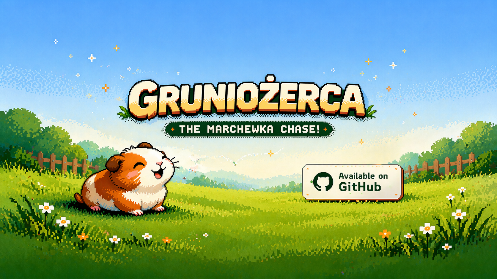

# Gruniożerca — DOS Port

Port of the NES arcade game **Gruniożerca** for DOS 6.22 / FreeDOS on 486-class hardware.

Original NES game by dizzy9 and Ryszard Brzukała, public domain.  
Music by Ozzed (CC BY-SA 3.0).  
DOS port by Sebastian Izycki, 2026 — [ar.hn/gruniozerca](https://ar.hn/gruniozerca/)

---

## Gameplay

The player controls Grunio the pig, catching color-coded falling carrots.  
Only carrots matching Grunio's current color score points — switch color on the fly to maximize combos.  
Catching a wrong-color carrot or letting one hit the ground costs a life. You have 6 lives.
---

## Building

### Requirements

| Tool | Purpose |
|------|---------|
| `i586-pc-msdosdjgpp-gcc` | DJGPP cross-compiler (C99, 32-bit DOS) |
| `gcc` (host) | Builds asset conversion tools |
| GNU make | Build system |
| DOSBox-X | Testing (optional) |

Install DJGPP on Linux/macOS:

```sh
bash dos/tools/setup_env.sh
```

On Windows (MSYS2):

```bat
dos\tools\setup_env.bat
```

### Build

```sh
cd dos

make all       # → build/GRUNIO.EXE
make assets    # convert NES CHR-ROM + music to DOS asset files
make pack      # → build/GRUNIO.DAT  (packed asset archive)
make tools     # build host-side conversion tools only
make clean     # remove build artifacts
make run       # launch in DOSBox-X
```

Full build from scratch:

```sh
cd dos
make tools
make assets
make all
make pack
```

### Distribution files

To run the game you need two files in the same directory:

```
GRUNIO.EXE   — main executable (DJGPP 32-bit DPMI)
GRUNIO.DAT   — packed asset archive (graphics, music)
CWSDPMI.EXE  — DPMI host (bundled with DJGPP)
```

### Asset pipeline

Pre-converted assets (`dos/assets/`) are included in the repo.  
To regenerate from original NES source files:

```sh
# CHR-ROM → VGA sprites + palette
dos/tools/chr2vga  nes/Gfx/chr.chr  dos/assets/sprites.dat  dos/assets/palette.dat

# FamiTone2 .mus → OPL2 event stream
dos/tools/mus2opl  nes/Muzyka/title.mus   dos/assets/music_0.opl
dos/tools/mus2opl  nes/Muzyka/ingame.mus  dos/assets/music_1.opl
dos/tools/mus2opl  nes/Muzyka/over.mus    dos/assets/music_2.opl
dos/tools/mus2opl  nes/Muzyka/empty.mus   dos/assets/music_3.opl
```

---

## Architecture

```
dos/
├── src/
│   ├── main.c          State machine: title → gameplay → gameover → hiscore
│   ├── video.c         VGA Mode 13h, tile cache, meta-sprites, palette fade
│   ├── timer.c         PIT channel 0 @ 60 Hz, DPMI ISR, waitframe()
│   ├── input.c         Keyboard ISR, joystick RC-timing, serial mouse UART
│   ├── player.c        fp8 physics, color cycling, walk animation
│   ├── carrot.c        Object pool (MAXOBJ=16), gravity, hit/miss detection
│   ├── score.c         BCD-compatible scoring, high score persistence
│   ├── sound.c         Auto-detect + backend dispatch
│   ├── sound_opl.c     AdLib/OPL2 FM synthesis, .opl event sequencer
│   ├── sound_sb.c      Sound Blaster DSP, Direct DAC, DMA
│   ├── sound_speaker.c PC Speaker PIT channel 2, melody sequencer
│   ├── config.c        INI parser/writer for GRUNIO.CFG
│   ├── memory.c        Linear bump allocator (256 KB pool)
│   ├── title.c         Title screen, settings menu, credits, tutorial
│   ├── gameover.c      Game over screen (settings.pcx background)
│   ├── hiscore.c       High score screen (hiscore.pcx background)
│   ├── pack.c          GRPK asset archive reader (GRUNIO.DAT)
│   └── pcx.c           PCX loader (8bpp indexed)
├── include/            Header files
├── assets/             Pre-converted game assets (PCX, RAD, OPL, DAT)
├── tools/
│   ├── chr2vga.c       NES 2bpp CHR-ROM → 8bpp VGA sprites + palette
│   ├── mus2opl.c       FamiTone2 .mus binary → OPL2 event stream
│   └── mkpack.c        Packs assets/ into GRUNIO.DAT archive
├── build/              Compiled output (gitignored)
├── Makefile
├── dosbox.conf         DOSBox-X configuration for testing
├── INSTALL.TXT         End-user installation guide (English)
└── CZYTAJ.TXT          Polish README with controls + sound info
```

---

## NES → DOS Mapping

| NES mechanism | DOS equivalent |
|---------------|----------------|
| NMI double-buffer | `video_backbuf[]` → `memcpy` to VRAM |
| `waitframe` (general.asm) | `waitframe()` busy-wait on PIT `tick_count` |
| ZP variables `$30–$AA` | C global structs (player, carrot pool, score) |
| Object pool `$0400` 16×14B | `CarrotPool` with `Carrot items[16]` array |
| APU pulse/triangle | OPL2 channels 0–2, noise → hi-hat `$BD` |
| CHR-ROM 2bpp tiles | Pre-decoded `tile_cache[256][64]` (8bpp) |
| Meta-sprites | `video_draw_meta_sprite()`, 5-byte entries |
| FamiTone2 .mus stream | `.opl` event stream (4 bytes/event) |
| Fixed-point 8.8 (`Macro.asm`) | `fp8_t = int16_t`, `FP8()`/`FP8_INT()` macros |
| BCD score combos | `CARROT_COMBO_PTS[8] = {11,15,21,22,25,31,32,35}` |
| SRAM save at `$6000` | `GRUNIO.SAV` binary file (4-byte uint32) |

---

## Key Constants (from `nes/Macro.asm`)

```c
#define GRUNIO_ACC        0x04    // acceleration per frame
#define GRUNIO_START_SPD  0x0100  // initial speed when input pressed
#define GRUNIO_TOP_SPD    0x0250  // maximum horizontal speed

#define GOLD_ACC          0x0E    // gravity per frame
#define GOLD_START_SPD    0x0150  // initial fall speed
#define GOLD_TOP_SPD      0x0250  // terminal velocity
#define MAXOBJ            16      // max simultaneous carrots
```

---

## Sound Detection

1. Parse `BLASTER` environment variable → Sound Blaster (highest priority)
2. Probe OPL2 timer registers at port `$388` → AdLib/OPL2
3. PC Speaker always available as fallback
4. User override via `GRUNIO.CFG` `[sound] card=...`

---

## Runtime Files

| File | Contents |
|------|---------|
| `GRUNIO.CFG` | INI config (input, sound, video) |
| `GRUNIO.SAV` | Binary high score (4 bytes, uint32 LE) |

---

## License

DOS port © 2026 Sebastian Izycki. Personal use permitted.  
Original NES game: Public Domain.  
Music by Ozzed: CC BY-SA 3.0.
